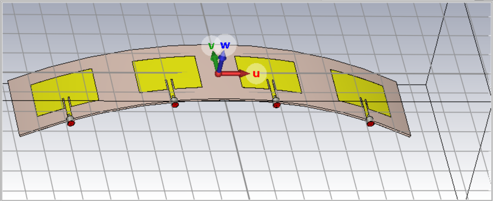
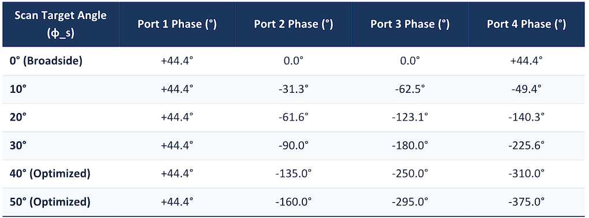

# 1×4 Conformal Microstrip Patch Antenna Array (Cylindrical Bend, R = 30 cm)

A 1×4 linear microstrip patch antenna array, designed for 2 GHz, conformally
bent onto a cylindrical surface of radius 300 mm (30 cm). Designed and
simulated in CST Studio Suite 2025, with phase-corrected feeding to
compensate for the curvature and steer the beam from broadside (0°) out to
50°.



Full analytical derivation (patch dimensions, effective dielectric constant,
fringing extension, and phase correction for curvature, from the single
element through to the 1×4 cylindrical array) is available in
[docs/Design_Calculations_Report.pdf](docs/Design_Calculations_Report.pdf).

## Design Specifications

| Parameter | Value |
|---|---|
| Design target frequency | 2 GHz |
| Substrate | FR-4 (lossy), εr = 4.3 |
| Substrate size (per element) | 300 mm × 56 mm |
| Substrate height (h) | 1.6 mm |
| Copper thickness (t) | 0.035 mm |
| Patch dimensions (W × L) | 45.5 mm × 32.4 mm |
| Feed type | Inset-fed microstrip |
| Feedline width | 3.1 mm |
| Inset notch depth | 10 mm |
| Inset gap | 1 mm |
| Element spacing (d) | 75 mm (0.5λ₀ at 2 GHz) |
| Cylindrical bend radius (R) | 300 mm |

Patch length was re-optimized from the analytically-derived 35.85 mm down to
32.4 mm to compensate for feed-pin loading and impedance shifts introduced
by the conformal bend (see `docs/Parameter_list.png` for the full CST
parameter set).

### Phase correction for curvature (broadside, 0°)

Bending the array introduces a physical path-length difference between the
inner and outer elements. The required phase lead on the outer elements to
restore a flat (broadside) wavefront:

| Port | Position | Phase |
|---|---|---|
| 1 (Outer Left) | -21.48° on cylinder | +44.4° |
| 2 (Inner Left) | -7.16° on cylinder | 0.0° |
| 3 (Inner Right) | +7.16° on cylinder | 0.0° |
| 4 (Outer Right) | +21.48° on cylinder | +44.4° |

### Beam-scanning phase table



| Target Angle | Port 1 | Port 2 | Port 3 | Port 4 |
|---|---|---|---|---|
| 0° (Broadside) | +44.4° | 0.0° | 0.0° | +44.4° |
| 10° | +44.4° | -31.3° | -62.5° | -49.4° |
| 20° | +44.4° | -61.6° | -123.1° | -140.3° |
| 30° | +44.4° | -90.0° | -180.0° | -225.6° |
| 40° (Optimized) | +44.4° | -135.0° | -250.0° | -310.0° |
| 50° (Optimized) | +44.4° | -160.0° | -295.0° | -375.0° |

## Simulated Results

| Target Angle | S11 | Resonant Freq | Gain | Main Lobe (actual) | 3dB Beamwidth | Sidelobe |
|---|---|---|---|---|---|---|
| 0° | -10.92 dB | 2.070 GHz | 7.08 dBi | 0.0° | 26.2° | -11.5 dB |
| 10° | -11.41 dB | 2.072 GHz | 6.94 dBi | 9.0° | 26.5° | -11.0 dB |
| 20° | -12.03 dB | 2.072 GHz | 6.54 dBi | 19.0° | 27.0° | -10.1 dB |
| 30° | -12.76 dB | 2.072 GHz | 5.89 dBi | 27.0° | 27.7° | -9.1 dB |
| 40° | -13.74 dB | 2.068 GHz | 4.84 dBi | 35.0° | 28.5° | -8.7 dB |
| 50° | -14.01 dB | 2.068 GHz | 3.8 dBi | 42.0° | 29.6° | -6.5 dB |

*(See `results/scan_XXdeg/` for the individual S11, gain, and 3D pattern
plots backing each row.)*

## Discussion

**Impedance match:** the array is well-matched at every simulated angle
(-10.92 dB to -14.01 dB, all clearing the standard -10 dB threshold against
a 2 GHz design target), confirming the re-optimized 32.4 mm patch length
successfully compensates for the R=300mm bend. Notably, S11 actually
improves slightly as the scan angle increases, even as pattern quality
(gain, sidelobe level) degrades — the port-combination weighting used for
wide-angle steering reduces total reflected power independently of how
well-formed the resulting beam is.

**Beam steering:** pointing accuracy is excellent through 20° (within 1° of
the commanded target), with gain and sidelobe level staying close to the
broadside baseline. From 30° onward, the array shows the classic phased-array
**scan loss** behavior expected at wide steering angles: main-lobe pointing
error grows (35° actual vs. 40° target; 42° actual vs. 50° target), gain
drops (7.08 → 3.8 dBi), and sidelobe level rises (-11.5 → -6.5 dB) as the
effective aperture and element pattern roll-off work against the array
factor. This is a genuine physical limitation of wide-angle scanning on a
curved 4-element array, not a simulation error — the phase values for 40°
and 50° required manual refinement beyond the pure analytical formula to
achieve even this level of steering accuracy.


## Repository Structure

```
1x4-cylindrical-patch-antenna-array/
├── design/     # CST Studio Suite project file + full project folder
├── docs/       # Geometry/parameter screenshots, solver setup, feed cabling,
│               # full calculations report (PDF)
└── results/
    ├── overview/        # 3D render of the conformal array
    ├── broadside/       # 0° results: S11, gain, 3D pattern, efficiency
    ├── scan_10deg/ ... scan_50deg/   # per-angle results
    └── vswr/
```

## Tools
- CST Studio Suite 2025

## Author
Habib Ur Rehman
